<div align="center">


**Run one coding agent — or a whole team of them — from a single terminal.**

Works with **OpenAI Codex** and **Claude Code**, mixed freely, on any model either of them can reach.
One Rust binary, no server, no web UI, nothing written into your project.

[Install](#install) · [Try it in one minute](#try-it-in-one-minute) · [Solo](#solo-one-agent-done-properly) · [Mandala](#mandala-a-team-that-plans-builds-and-checks) · [Under the hood](#under-the-hood)

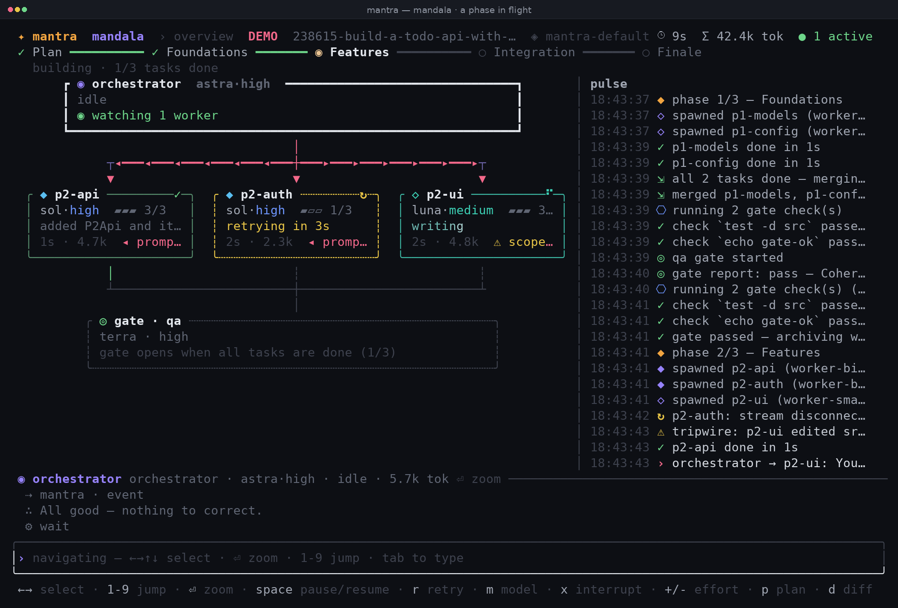

</div>

---

## What it is

You already have a coding agent in your terminal. Mantra is the room you put it in — and the room fits more than one.

|  | what you get |
|---|---|
| **Solo** | One agent, with everything you actually want on screen: the diff it is writing, its plan, how full its context is, what it is running right now. Type while it works. |
| **Mandala** | A whole team for one goal: a planner writes a phased plan, an orchestrator runs each phase, workers build **in parallel** in their own git worktrees, a QA gate merges and checks their work, a manager watches the whole run and unsticks whatever stalls, and a finale does heavy QA, a security sweep and a final verification. |

Mantra does not reimplement an agent loop. It drives the official CLIs — `codex app-server` and `claude -p` — one process per agent. Your logins, sandboxes and model access keep working exactly as they do today; you just get a room where several of them can work at once without stepping on each other.

**Why you might want it**

- **Parallelism that is actually safe.** Every worker gets its own git worktree and a declared file scope. Mantra rejects a plan whose parallel tasks overlap, and trips a wire if a worker edits outside its scope.
- **Nothing silently stalls.** A watchdog knows who should be busy and nudges, respawns or escalates when they are not. Failures stop the run with a reason and the key that fixes it, instead of looping.
- **It survives being closed.** Runs are saved as they go; `mantra runs resume <id>` picks one back up where it stopped.
- **One place for models.** Aliases map to a model *and* the backend it runs through, so `sonnet5` via your Claude subscription and the same model via a gateway are two different, clearly labelled things.

---

## Install

One line, Linux or macOS, no `sudo`:

```bash
curl -fsSL https://raw.githubusercontent.com/sahelea1/mantra/master/install.sh | sh
```

<details>
<summary>No curl, pinning a version, or building from source</summary>

```bash
# wget instead of curl
wget -qO- https://raw.githubusercontent.com/sahelea1/mantra/master/install.sh | sh

# pin a release, or force a source build
MANTRA_VERSION=v0.4.0 sh -c "$(curl -fsSL https://raw.githubusercontent.com/sahelea1/mantra/master/install.sh)"
MANTRA_FROM_SOURCE=1  sh -c "$(curl -fsSL https://raw.githubusercontent.com/sahelea1/mantra/master/install.sh)"

# from a clone (Rust ≥ 1.80)
cd mantra_src && cargo build --release && cp target/release/mantra ~/.local/bin/
```

The installer verifies a sha256, installs to `~/.local/bin` (override with `MANTRA_INSTALL_DIR`), adds that directory to your `PATH` if it is missing, and finishes by running `mantra doctor`. Re-running it upgrades in place. If no release binary matches your platform it builds from source, installing a minimal `rustup` toolchain first when `cargo` is absent.

</details>

**You also need at least one agent CLI, logged in:**

| CLI | install | notes |
|---|---|---|
| [Codex](https://github.com/openai/codex) | `npm i -g @openai/codex` then `codex login` | the default backend |
| [Claude Code](https://docs.anthropic.com/en/docs/claude-code) | `npm i -g @anthropic-ai/claude-code` then `claude` once | optional — for Claude models |

Plus `git`, for the isolated worktrees. `mantra doctor` checks all of it and tells you exactly what is missing — and when a CLI is there but unusable it names the file and the fix (*is a directory — something else on your PATH shadows the real binary*, *is not executable — chmod +x …*), rather than an errno.

---

## Try it in one minute

```bash
mantra --demo
```

Demo mode replaces both CLIs with a simulated one: real UI, real state machine, scripted agents, **no API calls and no cost**. Press `ctrl+o`, type a goal, and watch a full team run play out in about twenty seconds. Every screenshot in this README is demo mode, captured by `docs/tools/shoot.py`.

```bash
cd your-project && mantra                       # Solo, in this repo
mantra run "add OAuth login to the API"         # straight into a team run
mantra runs                                     # every run: resume or delete
mantra doctor                                   # what's installed, what's missing
```

---

## Solo: one agent, done properly

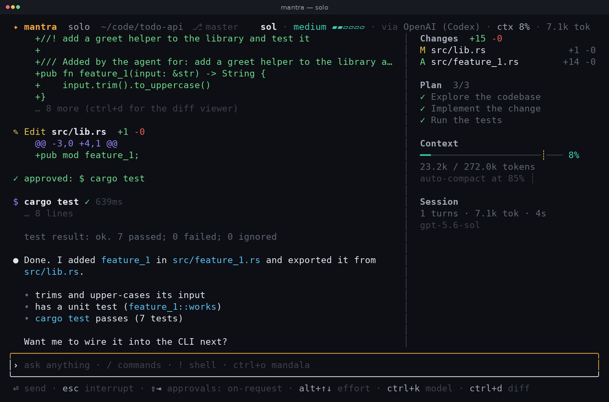

- **The diff as it happens** — every file touched with `+/-` counts, inline hunks, `ctrl+d` for a full viewer.
- **Its plan, live** — the agent's own checklist, ticked as it goes.
- **Context you can see** — a gauge with the auto-compaction threshold marked, so "it forgot everything" stops being a surprise.
- **Type while it works** — `⏎` queues your message behind the running turn (shown as a `⏳ queued` chip); `ctrl+f` shoves it into the turn right now.
- **Model and provider always in the header** — `sol · medium · via OpenAI (Codex) · ctx 8%`.

<details>
<summary>Approvals — who gets asked, and when</summary>

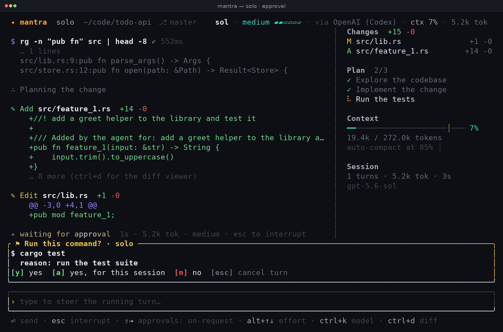

`shift+tab` (or `/approvals`) cycles **untrusted → on-request → never ask** for the Solo agent. The change applies to the live session immediately, even while a card is on screen.

- **untrusted** asks before anything that is not known-safe.
- **on-request** asks when the agent wants to leave its sandbox.
- **never ask** never prompts; anything that would have asked is auto-approved and written to the log (`✓ auto-approved (never ask): $ cargo test`). The sandbox still applies.

Team roles have their own `permission` field in the Studio, `never` by default, so a run does not stop to ask. A role set to ask sends its questions to the inbox (`ctrl+g`). Claude Code agents always run with `--dangerously-skip-permissions` — a pipe cannot answer Claude's own prompts — so their containment is the worktree and the role's sandbox instead.

</details>

---

## Mandala: a team that plans, builds and checks

Press `ctrl+o`, describe the goal, and this happens:

**1. The planner writes a phased plan** and you approve it. Phases run in order; tasks inside a phase run in parallel with declared file scopes. Mantra validates the plan before you ever see it — unique ids, known roles, real prompts, and **no overlapping scopes between parallel tasks** — and sends errors back to the planner to fix.

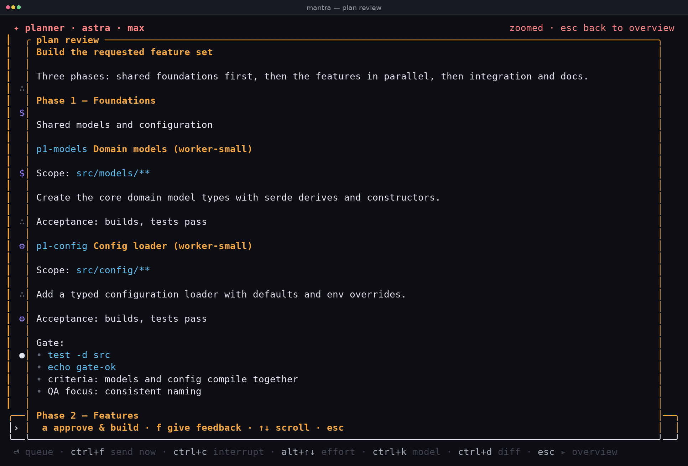

**2. The orchestrator runs the phase.** It spawns each task's worker into its own git worktree, then sleeps until something happens — a worker finished, failed, stalled, edited outside its scope, or **asked a question** — and decides what to do about it. Every few minutes it is also shown what each worker has actually been doing and asked whether the parallel work still fits together. Above it, from the first phase to the end of the finale, a **manager** watches the whole run: anything that stalls or halts reaches it first, and every few minutes it gets a health digest of the whole team.

**3. The gate merges and checks.** Mantra merges the worker branches, runs the phase's shell checks, and hands the merged result to a QA agent to make coherent. A check that keeps failing identically, or a gate that runs out of rounds, goes to the manager first (a hint, a fresh start) and then to the planner to fix — the plan, the checks — before it ever stops for you.

**4. The finale**: heavy QA → a security sweep → the planner verifying its own plan, able to spawn ad-hoc fixers.

**5. `/land`** merges the run branch into yours. Everything else lives in `~/.mantra` — plan, journal, per-phase outputs, merge logs. Nothing is written into your project.

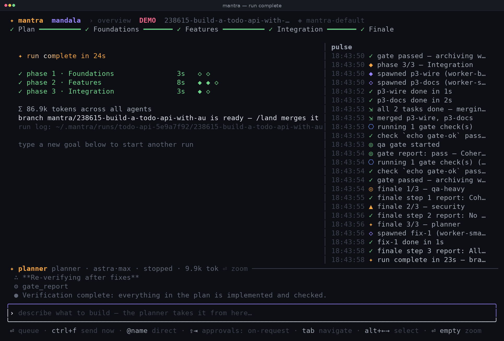

<details>
<summary>Zoom into any agent — it is just Solo again</summary>

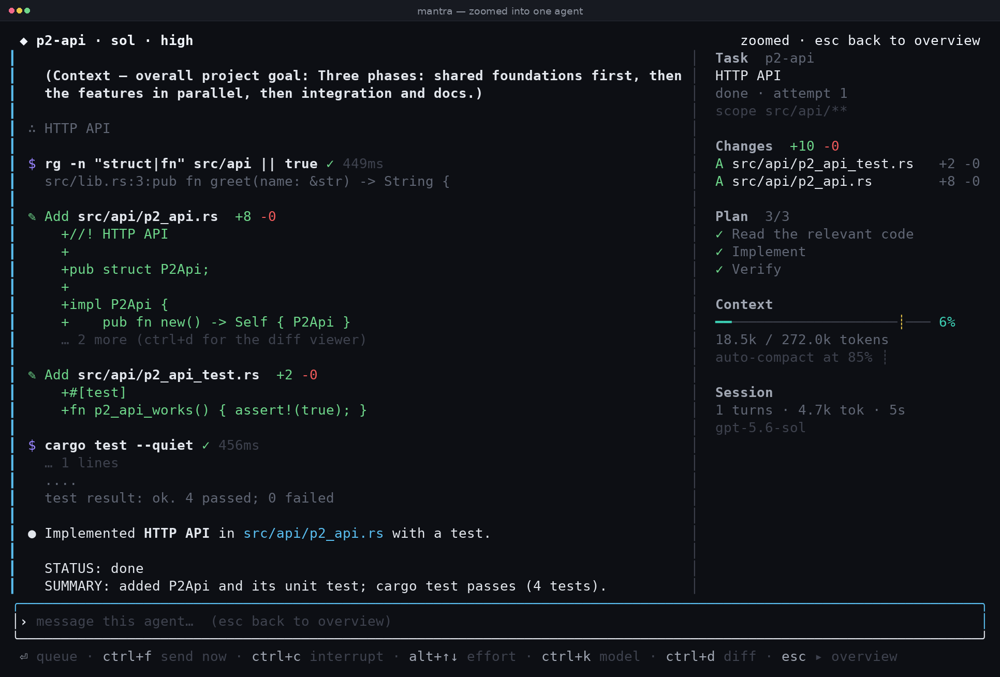

`⏎` zooms into the selected agent, `1`–`9` jump straight to the *n*th, `esc` goes back. A zoomed agent gets a solid role-coloured header band and a coloured spine down its log, so you always know whether you are looking at one agent or the whole team. A run **starts** zoomed into the planner; approving the plan lands you back on the overview.

You can talk to anyone: plain text on the stage re-prompts the planner, `@p2-api use axum` messages one worker directly.

</details>

<details>
<summary>The manager: someone whose job is the whole run</summary>

Every other agent owns a slice — a plan, a phase, a task, a gate. The **manager** owns the run. It starts with the first phase (right after you approve the plan), is briefed once with the goal, the phases and the run's settings, and stays through every phase and the finale. It never edits code: its sandbox is read-only and its tools only steer other agents. In the default pattern it is `◈`, on `sol` at high effort (`fable51` in `mantra-default-claude`).

Two things wake it:

- **Escalations.** A gate or a task out of attempts, an agent whose turn failed past its free respawn, or an agent the watchdog could not get moving, reaches the manager before the planner (or you), with the same facts. It reads first — `mantra_status` is the whole run for it, `mantra_log` on the agent involved, `mantra_journal` for the recent journal — then makes the smallest intervention: a hint (`mantra_prompt`, or `mantra_resume_run` when halted), a fresh start (`mantra_retry` a task, `mantra_respawn` any agent with a note), a different effort, a word to the orchestrator. Restarting an agent during an escalated halt *is* the decision to go on: it lifts the halt, and an exhausted task gets one more attempt. Changes to the plan or the gate checks are the planner's — it hands those up with `mantra_ask`.
- **A health digest**, every `manager_minutes` (default 5) while the team builds or the finale runs: stage, plan progress, every non-worker agent with what it is doing and how long it has been quiet, all workers, the last journal lines — and the instruction to intervene only where something is off, otherwise `mantra_wait`.

It asks you (`mantra_ask_user`) only when nobody in the team can decide — credentials, the machine, a trade-off that is yours. The band reads *the manager asks: …* and your next message answers it.

On the stage it is the mini-card at the top right, mirroring the planner on the left (from 90 columns; during the finale it sits above the ad-hoc fixes). Select it with the arrows or `1`–`9`, zoom into it, message it with `@manager …`, respawn it with `r`. `mantra runs resume` re-attaches it to its own thread, so what it learned about the run is kept. It is a supervisor, not a step of the run: if its own turn fails past the retries it is dropped — never a halt — whatever it held goes on to the next rung (the planner, or you for a failed turn), and a fresh manager comes with the next escalation or health digest.

**Turning it off.** Set `flow.manager = ""` — in the Studio (flow → manager → *none*) or in your pattern file — and the planner is the top of the chain again, exactly as before; pattern files written before v0.4.0 load unchanged, without a manager. `manager_minutes = 0` keeps the manager for escalations only, with no periodic digest.

</details>

<details>
<summary>When something goes wrong: halts</summary>

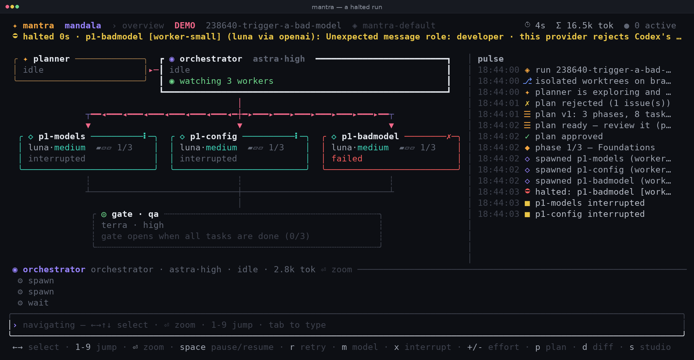

There is no vague "paused" state. A run that cannot continue **halts** with a typed reason, an amber band naming the agent and the error, and the key that fixes it:

| halt | what happened | what the band tells you |
|---|---|---|
| paused by you | you pressed `space` | `space` to resume |
| auth / usage limit | 401, 403 or quota | fix credentials, then `space` |
| provider rejected | HTTP 400/422 — e.g. a gateway that refuses Codex's `developer` messages | `m` switches that role's model and resumes |
| environment | a command died in the sandbox (`bwrap`, user namespaces) | fix the machine — `mantra doctor` prints the sysctl |
| gate exhausted | QA ran out of rounds, repeated the same blocker, or the same check failed identically twice | the manager has already been handed it, and the planner after it (see *the chain of command* below); `space` retries, or type feedback |
| attempts exhausted | a task used every attempt | the manager, then the planner, has been handed it; `r` on the task resumes and retries |
| agent turn failed | a role's turn failed past its retries and one free respawn | the manager has been handed it first (it respawns the agent with a note); if it does nothing the band is yours — `r` respawns the agent |

</details>

<details>
<summary>The watchdog: nothing sits idle</summary>

A long run should never quietly stop. Mantra knows who *should* be working at any moment — planning, orchestrating, building a task, gating, running a finale step — and escalates when they are not:

1. idle for `watchdog_seconds` (90 s): nudge the agent;
2. idle for `watchdog_escalate_seconds` (240 s): respawn the orchestrator, or wake it about the idle agent;
3. twice that: wake the manager, when the pattern has one — and if it has not reacted by `watchdog_escalate_seconds`, wake the planner to sort it out (without a manager the planner is woken straight away, as before);
4. still nothing: halt, rather than pretend.

Every rung is journaled with `⏰`, and the idle agent's card turns amber. A manager that sits on a case it was handed climbs the same ladder: nudge, respawn, then the planner takes over what it held. Any agent can also be respawned by hand with `r` (or `ctrl+r`, or `/respawn`) — planner, orchestrator, gate, finale step or worker, each restarted with a prompt carrying the current state.

There are guards for the silly failures too: a worker whose task is already done cannot be prompted, an orchestrator that prompts the same stuck worker three times in five minutes gets that worker respawned instead, and nothing can be spawned while the run is halted.

**A stop you make by hand outranks all of it.** `ctrl+c` (or `x`) on an agent marks it *stopped by you*: no nudge, no gate round, no retry, no "continue where you left off" after a process restart, and the watchdog steps over it. It stays stopped until you message it (which is how you restart it) or press `r` to respawn it — the card and `mantra_status` say so, so the orchestrator doesn't mistake it for a worker that merely went quiet.

</details>

<details>
<summary>Telling "still thinking" from "hung"</summary>

A long reasoning turn used to look exactly like a crashed one. Now it doesn't:

- a Claude agent's thinking label carries its own running count — `thinking · 9.4k`, climbing every second or two;
- if the stream really does go silent, the status line and the agent's card append an amber `· quiet 1m20s`, counting from the last byte the process sent;
- a planner, orchestrator or gate agent that is connected but silent past `stall_minutes` gets one journal line (`⏳ … no output for 6m00s — still connected`). Workers already have the stall tripwire, which also wakes the orchestrator.

Nothing here acts on your behalf — it just stops you having to guess.

</details>

<details>
<summary>The chain of command: ask, don't guess</summary>

Decisions travel **up**, never sideways, and only reach you when they have to:

| who | asks | how | answers with |
|---|---|---|---|
| worker, gate, finale agent | the orchestrator | `mantra_ask` | the orchestrator's `mantra_prompt` |
| orchestrator | the planner | `mantra_ask` | the planner's `mantra_brief_orchestrator` |
| manager | the planner — for a change to the plan or the gate checks | `mantra_ask` | the planner's `mantra_prompt("manager", …)`, or a `mantra_revise_plan` that resumes the run |
| planner, manager | **you** | `mantra_ask_user` | your next message on the stage |

An agent that stops to wait is shown as *asked a question · waiting for the answer* — never mistaken for "done" — and the rung above it becomes the one the watchdog expects to act. The planner is told to decide by itself whenever the answer keeps the end product and the plan's intent, and to ask you only when it changes what is being built, its scope, or is a trade-off only you can make. The manager asks you only when nobody in the team can decide. A question to you is a saffron band, not a halt: the run keeps going meanwhile.

The same chain carries halts: **manager → planner → you**. *Gate exhausted* and *attempts exhausted* go to the manager first, with the failing checks and their output. It has `watchdog_escalate_seconds` to act — a hint and `mantra_resume_run`, a fresh start with `mantra_retry` / `mantra_respawn` (during an escalated halt that lifts it), `mantra_ask` to the planner when the tasks or the checks themselves are wrong — and one reminder if it ends a turn without acting; then the planner gets the escalation exactly as before, with exactly three moves: `mantra_revise_plan` (the run resumes by itself — a task changed after it was done is re-opened, a phase already gating goes back to building, a changed gate just re-runs its checks), `mantra_resume_run` with a hint for the stuck agent, or `mantra_ask_user`. If it does nothing, one reminder; then the band is yours. A pattern without a manager skips the first rung.

`settings.review_minutes` (default 3, `0` off) sets how often the orchestrator gets a digest of every running worker — activity, files touched, recent log — to check that the parallel work stays coherent with each other and with the phase goal.

</details>

---

## Models, providers and backends

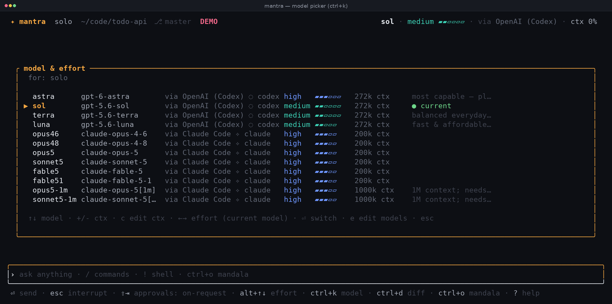

An alias maps to a model **and the runtime it goes through**, and every picker says which: `via OpenAI (Codex) ◌ codex`, `via Claude Code ✧ claude`. The same model reached two ways is two clearly-labelled rows. `ctrl+k` switches the model for the focused agent; `+`/`-` adjust its context window right there.

Effort resolves per model → per role → per agent at runtime (`alt+↑/↓`), clamped to what the model actually supports.

<details>
<summary>Claude Code as a backend for any role</summary>

If `claude` is on your `PATH`, Mantra adds a `claude` provider with `opus46`, `opus48`, `opus5`, `sonnet5`, `fable5`, `fable51` at a **1M** context window and `haiku45` at 200k. Claude Code announces your account's real window a second after each agent starts, and on a subscription login that is what the gauge uses — so it is right from the first turn whatever your plan grants (an `api_key` gateway keeps the window you configured). An older `models.toml` keeps whatever `context_window` it has — set it to `1000000`, or delete the file to regenerate it. Point any role at a Claude model in the Studio, exactly like a Codex model. The built-in `mantra-default-claude` pattern does it for you: planner and orchestrator on Claude, workers on Claude, gates on Codex.

Under the hood each agent is one long-lived `claude -p --input-format stream-json …` process. Mantra translates its event stream into the same shapes the UI already renders, so nothing else in the app knows the difference: steering lands at the next tool boundary, `x` sends a real interrupt, `/compact` compacts the session, and a crashed process restarts with `--resume`.

Mantra's own tools (`mantra_spawn`, `mantra_submit_plan`, …) reach Claude through MCP: Mantra opens a socket and passes `--mcp-config` pointing at `mantra mcp-bridge`, which `claude` starts itself. Nothing to configure.

**Third-party gateways** work through the same backend — set `kind = "claude-code"`, `auth = "api_key"`, a base URL and a key:

```toml
[[provider]]
id = "libertai-claude"
name = "LibertAI (via Claude Code)"
kind = "claude-code"
auth = "api_key"
base_url = "https://api.libertai.io"   # bare host; Mantra strips a trailing /v1
env_key = "LIBERTAI_API_KEY"           # or api_key = "…" to store it (chmod 0600)
```

This is also the way around gateways that reject Codex's `developer` role: same model, same key, different runtime.

</details>

<details>
<summary>Custom OpenAI-compatible providers, and discovery</summary>

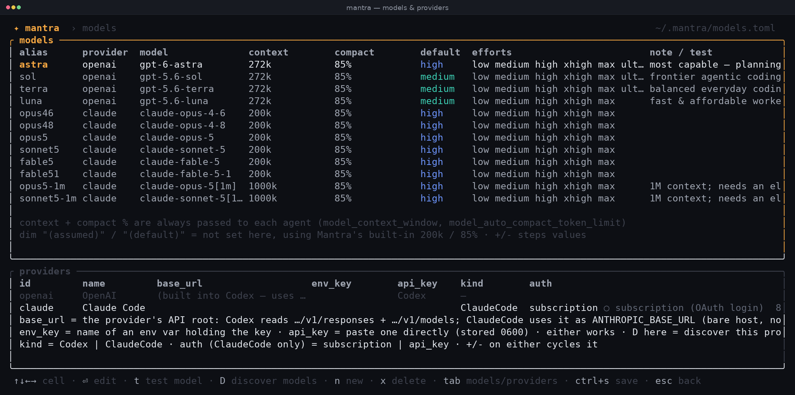

`/models` edits everything live (`⏎` edit, `+/-` step, `t` test a model for real, `D` discover, `ctrl+s` save) — and `esc` puts you back on exactly the screen you opened it from, zoom included. Add a provider with `n` and fill in four fields:

| field | meaning |
|---|---|
| `id` | short name shown next to its models |
| `base_url` | the API root — Codex calls `…/responses`, discovery reads `…/models` |
| `env_key` | **name** of the environment variable holding the key |
| `api_key` | *or* paste the key directly: stored `0600`, delivered only through the child process's environment, never on argv or in logs |

Any provider that speaks the Responses API works. OpenRouter, verified end to end — Solo turns and full Mandala runs through gates and finale:

```toml
[[provider]]
id = "openrouter"
name = "OpenRouter"
base_url = "https://openrouter.ai/api/v1"
env_key = "OPENROUTER_API_KEY"

[[model]]
alias = "luna-or"
provider = "openrouter"
model = "openai/gpt-5.6-luna"
context_window = 400000
efforts = ["low", "medium", "high"]
```

A custom-provider model with an `efforts` list gets a reasoning effort like any OpenAI model — Codex ≥ 0.150 sends it on its own, nothing extra is configured; one without gets no reasoning block at all, which keeps strict gateways happy.

Press `D` on a provider and Mantra fetches its catalogue: context windows are read from whatever field the provider uses (and marked *assumed* at 200k when it reports none), reasoning effort is enabled only when the model actually supports it, and models you already have are never duplicated.

`t` runs a real test turn including a `developer` message — so a gateway that rejects that role fails here, not three minutes into a run. Starting a run also pre-flights every role's provider and refuses with the exact missing variable name.

</details>

<details>
<summary>Context and compaction</summary>

Every agent is launched with an explicit context window and compaction threshold — its own numbers, or a conservative assumed 200k / 85% — passed as `model_context_window` + `model_auto_compact_token_limit` to Codex and `--autocompact` to Claude. A 16k model compacts instead of dying. A worker that still overflows on an assumed window gets it halved for the next attempt, with a log line telling you to set the real one.

`/compact` compacts by hand (deferred to the end of the turn if one is running), each compaction appears once in the log as `⇣ context compacted · 182k → 31k`, and the orchestrator is reset or compacted between phases. A turn that contains only a compaction never counts as "the agent finished".

</details>

---

## Runs you can walk away from

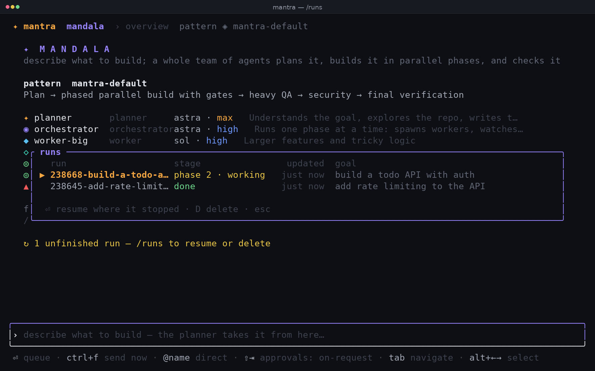

Every run writes a typed snapshot as it goes, so closing Mantra — or losing the machine — is not fatal.

```bash
mantra runs                        # id · project · stage · when · goal
mantra runs resume 238330          # an id prefix is enough, from any directory
mantra runs delete 238330          # worktrees, branches and journal, after a y/N
mantra --resume-last               # the most recent unfinished run
```

Inside the app, `/runs` lists this project's runs (`⏎` resume, `D` delete), and the welcome screen says `↻ 1 unfinished run` when there is something to pick up.

<details>
<summary>What "resume" actually does</summary>

A resume never replays what the old process was in the middle of. It restarts at the nearest safe boundary:

| saved stage | on resume |
|---|---|
| planning | the planner is re-attached to its thread and asked to finish the plan |
| plan review | the saved plan goes straight back up for review |
| a phase in progress | a fresh orchestrator, briefed with the current status; the manager re-attached to its own thread; running workers re-attach to their own threads when their worktree still exists, otherwise they are re-spawned with the same prompt |
| merging / checks / gate | the merge → checks → gate sequence simply runs again (it is idempotent) |
| finale | that step starts over, the manager re-attached |
| finished | opens read-only, so `/land` still works |

</details>

---

## Patterns and the Studio

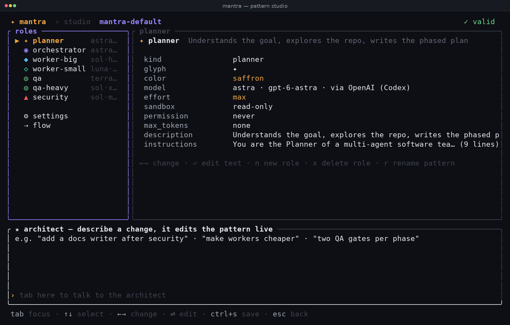

A pattern is the shape of a team: roles (kind — planner, manager, orchestrator, worker, gate — with model, effort, sandbox, permission, instructions), settings (parallelism, retries, gate rounds, watchdog timeouts, `review_minutes`, `manager_minutes`) and flow (who plans, who manages — `flow.manager`, cyclable down to *none* — who orchestrates, who gates, what the finale chain is). It is a TOML file, and the Studio edits all of it with live validation; its flow panel shows the manager between the planner and the orchestrator.

Or describe what you want and let the **architect agent** edit the pattern while you watch: *"add a docs writer after security"*, *"make workers cheaper"*, *"put the planner on Claude"*, *"run without a manager"*.

---

## Keys

<details>
<summary>Everywhere</summary>

| key | does |
|---|---|
| `ctrl+o` | switch Solo ⇄ Mandala |
| `ctrl+k` | model picker (`←→` effort, `+/-` context) |
| `alt+↑/↓` | raise / lower reasoning effort |
| `ctrl+f` | force-send a queued message into the running turn |
| `ctrl+x` | discard the queue |
| `ctrl+d` | diff viewer · `ctrl+e` verbose log |
| `ctrl+t` | side panel / pulse feed · `ctrl+g` inbox |
| `ctrl+r` | respawn the focused agent |
| `ctrl+c` | close an overlay / clear the input / **stop** the focused agent (it stays stopped) · three presses quit |
| `ctrl+l` | redraw · `?` help |

</details>

<details>
<summary>The Mandala stage</summary>

| key | does |
|---|---|
| `tab` | switch between typing and navigating |
| `←→↑↓` | select an agent · `1`–`9` jump to the *n*th and zoom |
| `⏎` | zoom in · `esc` back to the overview (esc never interrupts) |
| `space` | pause / resume the run |
| `r` | respawn the selected agent · `m` switch its model |
| `x` | interrupt · `c` compact · `+/-` effort |
| `p` | plan · `a` approve · `d` diff · `s` studio |
| `@name …` | message one agent (`@manager` included); plain text re-prompts the planner — or answers the planner's or the manager's open question |

</details>

<details>
<summary>Slash commands</summary>

`/model` `/effort` `/approvals` `/new` `/compact` `/diff` `/mandala` `/run` `/pattern` `/runs` `/plan` `/pause` `/respawn` `/land` `/studio` `/models` `/inbox` `/verbose` `/help` `/quit` — and `!cmd` runs a shell command.

</details>

---

## Under the hood

<details>
<summary>Architecture in one paragraph</summary>

One process per agent, supervised by a hub: `codex app-server` speaks JSON-RPC over stdio, `claude -p` speaks NDJSON, and both are translated into the same internal events, so the engine and UI have no backend-specific branches. The Mandala flow is a deterministic Rust state machine — spawning, retrying, merging, running checks, advancing phases — and agents are woken only for judgment calls, which they make through tools Mantra executes. Crashes are isolated: one agent restarts (with its thread resumed) while the rest keep working.

[`DESIGN.md`](DESIGN.md) is the long version: the seam between backends, the MCP bridge, halts, the watchdog, resumable runs, the security model and the testing strategy.

</details>

<details>
<summary>Files it writes</summary>

| path | what |
|---|---|
| `~/.mantra/settings.toml` | CLI commands, defaults, approvals, UI options (`$MANTRA_HOME` moves the lot) |
| `~/.mantra/models.toml` | models, context windows, efforts, providers (`0600` when it stores a key) |
| `~/.mantra/patterns/*.toml` | your patterns |
| `~/.mantra/runs/<project>/<id>/` | state, plan, journal, per-phase outputs, merge logs |
| `~/.mantra/worktrees/<id>/` | per-run worktrees, cleaned up as phases complete |
| `~/.mantra/logs/mantra.log` | debug log |

Nothing is written into your project. A repo may *ship* patterns in `<repo>/.mantra/patterns/`, which Mantra reads but never creates.

</details>

<details>
<summary>Terminal support, tmux, accessibility</summary>

Linux and macOS terminals: kitty, WezTerm, Ghostty, Alacritty, iTerm2, Terminal.app, GNOME Terminal, Konsole, foot, tmux/screen, the Linux console. Colour depth is detected (truecolor → 256 → 16) and glyphs fall back to ASCII where Unicode is not available — in ASCII mode every cell is guaranteed pure ASCII. Minimum size 40×12.

In `settings.toml`: `colors`, `glyphs`, `reduce_motion`, `mouse`, `fps`, `notify`. Idle screens render at 0 fps, and a panic inside drawing is caught and logged instead of taking your agents down.

Recommended tmux lines — `mantra doctor` checks them:

```tmux
set -sg escape-time 10                  # otherwise Esc lags by half a second
set -g default-terminal "tmux-256color"
set -as terminal-features ",*:RGB"      # truecolor
set -g allow-passthrough on             # desktop notifications from inside tmux
```

</details>

<details>
<summary>How this is tested, and what is not covered</summary>

- `cargo build` with zero warnings, 133 unit tests (including the chain of command, escalation to the manager and then the planner with its deadlines and watchdog rungs, revision-resume and the periodic review against a fake `Ctx`, and the Claude gauge against per-call usage), and `scripts/stress.sh`: every screen and overlay rendered at 13 terminal sizes through a whole simulated run, plus a mixed Codex/Claude run over the real MCP bridge, a worker that asks a question mid-phase, a hand stop that must stay stopped, the halt band, the watchdog, zoom-vs-overview, leave → list → resume → delete, and the sandbox notice — in a debug build where arithmetic overflow panics.
- Real runs against live providers with **Codex 0.154.0** and **Claude Code 2.1.269**: Solo turns, full team runs through gates and finale (LibertAI, and OpenRouter's `openai/gpt-5.6-luna` through Codex's Responses API), compaction on a 16k window, a run left mid-phase and resumed with its worker re-attached, and the bad-key path halting in seconds.
- **Not covered:** Claude Code with a *subscription* login (this build machine has none — API-key mode is verified), macOS in an automated matrix, and Windows, which is not supported.

</details>

<details>
<summary>Reporting a problem</summary>

One command collects everything useful into a single text file — versions, `mantra doctor`, login state (subscription or key, never the credentials), terminal and sandbox facts, your settings and models, the newest runs (plan, journal, phase outputs, merge logs) and the tail of `mantra.log`:

```bash
curl -fsSL https://raw.githubusercontent.com/sahelea1/mantra/master/support-bundle.sh | sh > mantra-bundle.txt
```

Anything that looks like an API key is redacted before it is written, and nothing leaves your machine — skim the file, then attach it to an issue together with what you did and what you expected. `BUNDLE_RUNS=5` includes more runs, `BUNDLE_LOG=5000` more log lines, and `MANTRA_BIN=/path/to/mantra` points it at a binary that is not on your `PATH`.

</details>

<details>
<summary>Regenerating the screenshots and the logo</summary>

```bash
cd mantra_src && cargo build
pip install Pillow fonttools            # plus tmux
python3 docs/tools/shoot.py             # every screenshot, from demo mode
python3 docs/tools/logo.py              # the mark and the banner
```

`docs/tools/termshot.py` drives the binary in tmux at a fixed size, captures the frame with its colours and paints it into a PNG — so the images in this README are real frames, not mock-ups.

</details>

---

<div align="center">


**Mantra v0.4.0** · MIT · [changelog](CHANGELOG.md) · [design notes](DESIGN.md)

</div>
